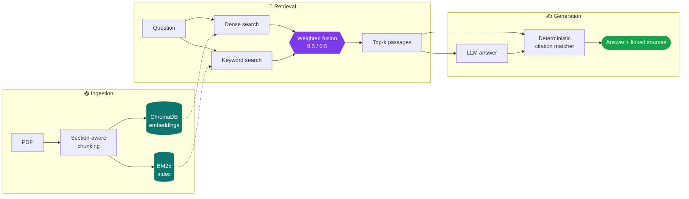

<div align="center">

<h1>ResearchGPT</h1>

<p>
  <b>Ask research papers a question. Get an answer grounded in the source text,<br>
  with citations that link back to the exact passage they came from.</b>
</p>

<p>
  <a href="https://researchgpt-dljnaee32a-uc.a.run.app">
    
  </a>
  <a href="docs/EVALUATION.md">
    
  </a>
</p>

<p>
  <a href="https://github.com/nadeemshabir/ResearchGPT/actions/workflows/ci.yml">
    
  </a>
  
  
  
  
  <a href="LICENSE">
    
  </a>
</p>

<p>
  <a href="https://researchgpt-dljnaee32a-uc.a.run.app"><b>Live demo</b></a> ·
  <a href="docs/EVALUATION.md">Evaluation</a> ·
  <a href="docs/ARCHITECTURE.md">Architecture</a> ·
  <a href="docs/API.md">API</a> ·
  <a href="docs/DEPLOY.md">Deploy</a> ·
  <a href="plan.md">Roadmap</a>
</p>

</div>

---

> [!IMPORTANT]
> **The live demo has eight papers already indexed** — nothing to upload, just ask.
> It scales to zero, so the first request after an idle period waits **60–90 seconds**
> for a cold start. The app shows a loading screen while it wakes.
>
> 🔗 **https://researchgpt-dljnaee32a-uc.a.run.app**

---

## ✨ What it does

| | Capability | How it works |
|:--:|---|---|
| 🔀 | **Hybrid retrieval** | Dense embeddings fused with BM25, so both paraphrases *and* exact terms — model names, metrics, numbers — are matched. |
| 🎯 | **Cross-encoder reranking** | A shortlist can be rescored by a model that reads query and passage together. **Off by default:** it was measured and did not earn its cost. |
| 📑 | **Section-aware chunking** | Headings are detected, and no chunk is allowed to cross a section boundary. |
| 🔗 | **Deterministic citations** | Sources are attached *in code*, by matching each paragraph against the chunks it was built from — never written by the model. |
| 🛑 | **Grounded refusal** | When nothing relevant is indexed, the system says so instead of answering from the model's own memory. |
| 🧭 | **Query routing** | Comparisons and literature reviews can take dedicated retrieval paths. **Off in the API by default:** the rules are unevaluated, so the served path is the measured one. |
| 🔌 | **Multi-provider LLM** | Groq, OpenAI, or Gemini — swap with one environment variable. |

---

## 🔬 How it works



Full walkthrough in [docs/ARCHITECTURE.md](docs/ARCHITECTURE.md).

---

## 📊 Results

Measured on [BEIR/SciFact](https://huggingface.co/datasets/BeIR/scifact) — 300
expert-labelled queries over 5,183 scientific abstracts. No hand-written or
LLM-generated labels. Full methodology in [docs/EVALUATION.md](docs/EVALUATION.md);
reproduce with `make eval`.

| Configuration | Recall@5 | Recall@10 | MRR | nDCG@10 | p95 latency |
|---|:--:|:--:|:--:|:--:|:--:|
| BM25 only | 0.6969 | 0.7598 | 0.5937 | 0.6301 | 98 ms |
| Dense only (MiniLM) | 0.7346 | 0.7833 | 0.6012 | 0.6422 | 40 ms |
| Hybrid weighted 0.7/0.3 *(old default)* | 0.7523 | 0.8110 | 0.6512 | 0.6873 | 179 ms |
| Hybrid RRF (k=60) | 0.7141 | 0.7924 | 0.6222 | 0.6599 | 178 ms |
| Hybrid weighted 0.7/0.3 + rerank | 0.7416 | 0.8272 | 0.6629 | 0.6948 | 4,998 ms |
| 🏆 **Hybrid weighted 0.5/0.5 (tuned)** | 0.7505 | **0.8202** | **0.6632** | **0.6972** | **179 ms** |

> [!TIP]
> **Headline:** at the tuned setting nDCG@10 reaches **0.6972**, above ColBERTv2's
> published 0.693 — on CPU. It was reached by tuning one float, not by adding a
> cross-encoder.

Four things worth pulling out:

- **Hybrid retrieval earns its complexity** — Recall@5 improves 5.5 points over
  BM25 and 1.8 over dense retrieval. Fusion beats either component on every metric.
- **Tuning one float beat adding a cross-encoder.** A weight sweep found the
  inherited 0.7/0.3 split was suboptimal; 0.5/0.5 matches or beats the reranked
  pipeline on 3 of 4 metrics **at 1/28th the latency**.
- **So the reranker does *not* earn its cost here** — 28× latency for +0.75
  nDCG points, and Recall@5 actually drops 1.1. Likely domain mismatch: the
  `ms-marco` cross-encoder was trained on web search, not scientific claims.
- **RRF underperformed weighted fusion**, by 3.8 recall points — against the usual
  advice, and against my own expectation. It is the default in Elasticsearch and
  Qdrant, but SciFact rewards the confidence signal RRF discards by design.

Meanwhile the BM25 component sits 3.5 points *below* the published BEIR
baseline — a tokenisation gap that is a concrete open task.

### Generation was measured too, and most of it does not count

The RAGAS scores exist (faithfulness 0.8650, answer relevancy 0.8026 over 43
questions) but they are **withdrawn, not quoted**. Calibrating the LLM judge
against 23 hand-graded answers returned Cohen's κ = −0.195 — worse than chance.
The judge scored 0.781 on answers a human called supported and 0.783 on ones a
human rejected, so it is not measuring what it claims to measure.

What survives is what is counted in code rather than judged by a model:

| Result | Number |
|---|:--:|
| Unanswerable questions declined | **23 / 23** |
| Citation rate, deterministic citer | **1.0000** (0 fabricated) |
| Citation coverage — the *right* sources named | **0.9225** |
| Median latency per question | **2.7 s** |

> [!NOTE]
> The 1.0000 is true by construction, not discovered. Coverage and the zero
> fabrications are the rows that carry information. Full reasoning, including why
> the judge scores stay withdrawn, is in [docs/EVALUATION.md](docs/EVALUATION.md).

---

## ⚡ Quick start

```bash
git clone https://github.com/nadeemshabir/ResearchGPT.git
cd ResearchGPT

python -m venv venv
source venv/bin/activate          # Windows: venv\Scripts\activate

make install                       # or: pip install -r requirements.txt
cp .env.example .env               # then add your API key
```

Get a free Groq key at [console.groq.com](https://console.groq.com) — no credit
card required — and put it in `.env`:

```
GROQ_API_KEY=your_key_here
```

Then:

```bash
make frontend-install   # once: install the UI's node dependencies
make corpus             # optional: download 8 open-access papers into data/raw/
make index              # index whatever is in data/raw/
make serve              # build the UI, then serve API + UI on http://localhost:8000
```

Ask a question in the composer. Click a citation to open the passage it came
from. Upload more PDFs from the library drawer — ingestion runs in the
background and the drawer reports progress.

`make api` serves the JSON API alone (docs at `/docs`), and `make frontend-dev`
runs Vite on :5173 against it for UI work.

---

## ⚙️ Configuration

Every parameter lives in [`src/config.py`](src/config.py) and can be overridden
from `.env`. See [`.env.example`](.env.example) for the full list. The ones
worth knowing:

| Setting | Default | Notes |
|---|:--:|---|
| `EMBEDDING_MODEL` | `all-MiniLM-L6-v2` | Changing this after indexing requires re-ingesting; the app detects the mismatch and tells you. |
| `CHUNK_SIZE` / `CHUNK_OVERLAP` | `1000` / `200` | Measured in tokens, not characters. |
| `SEMANTIC_WEIGHT` / `KEYWORD_WEIGHT` | `0.5` / `0.5` | Tuned by sweep on SciFact. The old 0.7/0.3 cost ~1 nDCG point. |
| `FUSION_METHOD` | `weighted` | `weighted` beat `rrf` by 3.8 Recall@5 points, even after tuning RRF's `k`. |
| `USE_RERANKING` | `false` | Off on evidence: 28× latency for +0.75 nDCG, and Recall@5 *drops*. |
| `USE_MULTI_AGENT` | `true` | ~`chunks + 3` LLM calls vs 1 for single-shot, and not yet shown to be worth it. |
| `USE_CITATIONS` | `true` | Deterministic paragraph citations. Beat LLM-written citations on every axis. |
| `USE_SMART_ROUTING` | `true` | Config default only — the API overrides it to `false`, because routing is unevaluated. |
| `TOP_K_RETRIEVE` / `TOP_K_RERANK` | `50` / `10` | Candidates fetched, then kept. |

---

## 🗂️ Project layout

<details>
<summary><b>Expand the tree</b></summary>

<br>

```
src/
  config.py          all tunable parameters
  exceptions.py      typed error hierarchy
  utils/             logging, retry, device selection
  ingestion/         PDF parsing, chunking, embedding, vector store
  retrieval/         dense, BM25, fusion, reranking, query processing
  generation/        LLM client, prompts, agents, routing, citations
api/                 FastAPI app, schemas, background jobs
frontend/            React + Vite UI, built into static/ and served by the API
test/                307 tests, all offline
eval/                BEIR harness, RAGAS, refusal, judge calibration
scripts/             corpus download, indexing, store reset
deploy/              Cloud Run deployment script
Dockerfile           multi-stage build; indexes the corpus at build time
docs/                ARCHITECTURE.md, API.md, EVALUATION.md, DEPLOY.md
plan.md              roadmap
```

</details>

---

## 🛠️ Development

```bash
make install-dev    # runtime + dev dependencies
make frontend-install
make serve          # build the UI, serve API + UI on :8000

make test           # 307 tests, offline, ~40s
make check          # lint + typecheck + tests
make docker         # build the image (fetches and indexes the corpus)
make deploy PROJECT=my-project   # build and ship to Cloud Run
```

CI ([`.github/workflows/ci.yml`](.github/workflows/ci.yml)) runs three jobs:
lint, types and tests; the frontend typecheck and build; then a Docker build
that boots the image and asserts `/health` reports `ok` with all 8 papers
indexed — so a broken download URL or a chunking regression fails in CI rather
than on deploy. Deployment itself is manual, see
[docs/DEPLOY.md](docs/DEPLOY.md).

Three conventions hold throughout `src/`:

1. Library code **logs**; it never prints. Entry points (`scripts/`, `eval/`)
   print. `ruff`'s `T20` rule enforces this.
2. Constants live in `src/config.py` and nowhere else, so evaluation sweeps can
   vary them from a single place.
3. No test calls a real provider. Clients are stubbed and the retry policy's
   sleeps are patched, so the suite runs offline with no API keys.

---

## 🧱 Tech stack

<div align="center">


</div>

FastAPI · React + Vite · ChromaDB · sentence-transformers · rank-bm25 ·
PyMuPDF · tiktoken · pydantic-settings · KaTeX · Groq / OpenAI / Gemini

The UI was Streamlit until Milestone 3. It was replaced because it capped how
the interface could look and could not express the thing this project is built
around: clicking a claim to see the passage behind it.

---

## 🗺️ Roadmap

See [plan.md](plan.md). In short:

- [x] **M1 — Foundation.** Config layer, typed exceptions, structured logging,
      error handling at every boundary, repo hygiene.
- [x] **M2a — Retrieval evaluation.** BEIR/SciFact harness, four ablations and
      two parameter sweeps over 300 expert-labelled queries. Two shipped
      defaults changed on the evidence. See [docs/EVALUATION.md](docs/EVALUATION.md).
- [x] **M2b — Generation evaluation.** RAGAS over 43 questions, refusal on 23
      unanswerable ones, and judge calibration against hand grades. The
      calibration failed (κ = −0.195), so the judged scores are withdrawn and
      only the code-counted results are quoted. Deterministic citations shipped
      out of this milestone.
- [x] **M3 — Productionisation.** 307 offline tests, FastAPI with SSE stage
      streaming, a React frontend replacing Streamlit, Docker, CI, and a Cloud
      Run deployment. **Not done:** per-query cost and latency tracking on a
      `/metrics` endpoint.
- [ ] **M4 — Differentiation.** One deeper capability, measured against the
      M2 harness.

---

## 📄 License

MIT — see [LICENSE](LICENSE).

<div align="center">
<br>

**[Try the live demo →](https://researchgpt-dljnaee32a-uc.a.run.app)**

Built by [Nadeem Shabir](https://github.com/nadeemshabir)

<sub>If this project is useful to you, a ⭐ on the repo is appreciated.</sub>

</div>
