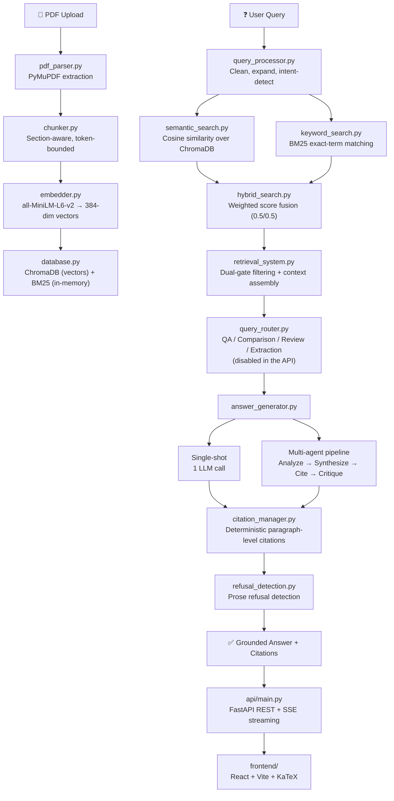

# ResearchGPT — Full Project Deep Dive

A complete technical understanding of every module, decision, and data flow in the project.

---

## System Overview

ResearchGPT is a **Retrieval-Augmented Generation (RAG)** system for asking questions over research papers. Upload PDFs → index them → ask questions in natural language → get grounded answers with citations back to the source passages.



---

## Layer 0: Foundation

### [config.py](file:///d:/AI%20projects/ResearchGPT/src/config.py) — The Single Source of Truth

Every tunable parameter lives here and **nowhere else**. This is a convention, not a lint rule — `ruff`'s `T20` enforces the *other* invariant (no `print()` under `src/` or `api/`). The reason it matters is the evaluation: a weight sweep can only vary `semantic_weight` from one place, and two shipped defaults changed because it could. Uses `pydantic-settings` with a `BaseSettings` class that reads from `.env` with an inline-comment cleaner (`_clean_env_values`) to handle Docker vs dotenv parsing inconsistencies.

**Key parameters (all tested on BEIR/SciFact unless marked):**

| Parameter | Value | Tested? |
|---|---|---|
| `semantic_weight / keyword_weight` | 0.5 / 0.5 | ✅ Swept 0.0–1.0 |
| `fusion_method` | `weighted` | ✅ Beat RRF by 3.8 Recall@5 |
| `use_reranking` | `false` | ✅ 28× latency, −1.1 Recall@5 |
| `min_semantic_similarity` | 0.40 | Weakly (6 probes) |
| `chunk_size / chunk_overlap` | 1000 / 200 tokens | ❌ Untestable on abstracts |
| `embedding_model` | `all-MiniLM-L6-v2` | ❌ Inherited |
| `use_deterministic_citations` | `true` | ✅ Beat LLM citations on every axis |

### [exceptions.py](file:///d:/AI%20projects/ResearchGPT/src/exceptions.py) — Typed Error Hierarchy

Every boundary (PDF parsing, vector store, LLM providers) translates library exceptions into a typed hierarchy rooted at `ResearchGPTError`. This lets callers handle failures **by category** rather than string-matching.

```
ResearchGPTError
├── ConfigurationError
├── IngestionError
│   ├── PDFParseError (EncryptedPDFError, CorruptPDFError, EmptyPDFError, PDFTooLargeError)
│   └── ChunkingError
├── VectorStoreError
│   ├── EmbeddingDimensionMismatchError
│   └── EmptyCollectionError
├── RetrievalError
│   └── NoRelevantContextError   ← raised instead of returning empty context
└── LLMError
    ├── LLMProviderError         ← non-retryable
    ├── LLMAuthenticationError   ← non-retryable
    ├── LLMRateLimitError        ← retryable
    ├── LLMTimeoutError          ← retryable
    └── LLMResponseError         ← non-retryable
```

**Design decision:** `NoRelevantContextError` is **raised, not returned as empty**. An LLM given an empty context window doesn't decline — it answers from parametric memory, producing the ungrounded hallucination this system exists to prevent.

### [src/utils/](file:///d:/AI%20projects/ResearchGPT/src/utils/)

| File | Purpose |
|---|---|
| [logging.py](file:///d:/AI%20projects/ResearchGPT/src/utils/logging.py) | `researchgpt.*` logger tree with JSON formatter for aggregation. Library code logs; entry points print. Idempotent `setup_logging()` so repeated calls do not stack duplicate handlers — its docstring still names Streamlit as the reason, which is now stale, but the reload case it guards against is real under `make api-dev`. |
| [retry.py](file:///d:/AI%20projects/ResearchGPT/src/utils/retry.py) | Exponential backoff with **full jitter** (`random.uniform(0, delay)`) so concurrent multi-agent calls don't retry in lockstep. Only `LLMRateLimitError` and `LLMTimeoutError` are retried; auth failures fail immediately. |
| [device.py](file:///d:/AI%20projects/ResearchGPT/src/utils/device.py) | `resolve_device()`: CUDA → MPS → CPU auto-detection. Probes are wrapped in bare `except` because backend checks can raise on unexpected hardware. |

---

## Layer 1: Ingestion Pipeline

### [pdf_parser.py](file:///d:/AI%20projects/ResearchGPT/src/ingestion/pdf_parser.py) — PDF Text & Metadata Extraction

Three backends (PyMuPDF default, pdfplumber for tables, PyPDF2 fallback). Key behaviours:

- **File validation** before parsing: checks `%PDF-` magic bytes, file size vs `max_pdf_size_mb`, zero-byte detection.
- **Title recovery from page 1** when `/Title` metadata is empty (5 of 8 corpus papers had no embedded title). Uses regex heuristics: skips arXiv stamps (`_PRE_TITLE_NOISE`), stops at author blocks detected by absence of function words + presence of author marks (daggers, commas).
- **Ligature expansion**: `fi` → `fi`, `fl` → `fl`, etc. Without this, "workflow" extracted with an fl-ligature silently breaks BM25 keyword matching.
- **Cleaning runs AFTER chunking** — this ordering is load-bearing. `clean_text()` collapses newlines, which section detection needs.

### [chunker.py](file:///d:/AI%20projects/ResearchGPT/src/ingestion/chunker.py) — Section-Aware Token-Bounded Chunking

- **Token-based, not character-based.** Uses `tiktoken` (`cl100k_base` encoding) so `chunk_size=1000` means 1000 tokens, not characters. Character-based splitting lets chunks overflow the embedding model's context window, silently truncating the tail.
- **Section detection:** Lines matching known academic headings (`SECTION_HEADERS`: Abstract, Introduction, Methods, Results, etc.) after stripping section numbers (`3.1`, `IV.`) start new sections. No chunk crosses a section boundary.
- **Separator hierarchy:** `\n\n\n` → `\n\n` → `\n` → `. ` → ` ` → `""` (uses `RecursiveCharacterTextSplitter` from `langchain`).
- **Overlap:** 200 tokens shared between neighbouring chunks so arguments that span a boundary aren't lost.

### [embedder.py](file:///d:/AI%20projects/ResearchGPT/src/ingestion/embedder.py) — Dense Vector Generation

- Wraps `sentence-transformers`'s `SentenceTransformer` model.
- `all-MiniLM-L6-v2`: 384-dimensional vectors, fast, small. `allenai/specter` (768-dim, science-tuned) is the documented alternative but requires re-ingestion.
- Batch encoding with configurable `batch_size` (default 32).
- Model loaded eagerly in `__init__` so a bad model name fails at startup, not on first query.

### [database.py](file:///d:/AI%20projects/ResearchGPT/src/ingestion/database.py) — ChromaDB Vector Store

- **Persistent client** on disk at `data/chroma_db/`.
- **Embedding provenance:** The collection stores which model and dimension built it. Changing `EMBEDDING_MODEL` after indexing raises `EmbeddingDimensionMismatchError` at startup rather than an opaque Chroma error at query time. Same-dimension model swaps warn.
- **Upsert, not insert:** Re-ingesting a paper replaces its chunks instead of failing on duplicate IDs.
- **Metadata sanitisation:** Chroma rejects `None` and nested structures. `_sanitise_metadata()` coerces everything to scalar types.
- `query()` clamps `n_results` to collection size to avoid Chroma warnings.

### [pipeline.py](file:///d:/AI%20projects/ResearchGPT/src/ingestion/pipeline.py) — End-to-End Orchestration

Steps: Parse → Chunk → Clean each chunk → Embed → Store. The ordering (chunk raw text, then clean each chunk) preserves section boundaries.

---

## Layer 2: Retrieval Engine

### [semantic_search.py](file:///d:/AI%20projects/ResearchGPT/src/retrieval/semantic_search.py) — Dense Vector Search

- Embeds the query, does nearest-neighbour search in ChromaDB.
- Chroma returns **squared L2 distance** (lower = better). Converted to bounded 0–1 similarity: `1 / (1 + distance)`.
- `search_with_context()` attaches neighbouring chunks (window ±1) for passages that land mid-argument.
- `multi_query_search()` searches several rephrasings and merges by max/mean/sum aggregation.

### [keyword_search.py](file:///d:/AI%20projects/ResearchGPT/src/retrieval/keyword_search.py) — BM25 Lexical Search

- **In-memory `BM25Okapi` index** built from the entire ChromaDB collection.
- **Auto-refreshes** when `collection.count()` changes — papers uploaded during a session were previously invisible to keyword search for the life of the process.
- Tokenisation: lowercase regex `[a-z0-9]+(?:-[a-z0-9]+)*` — preserves "self-attention" as one token. No stemming, no stopword removal (known gap: trails published BEIR BM25 baseline by 3.5 nDCG points).
- `search_with_phrases()` boosts quoted phrases by 1.5× per match.

### [hybrid_search.py](file:///d:/AI%20projects/ResearchGPT/src/retrieval/hybrid_search.py) — Fusion of Dense + BM25

Two fusion strategies:

**1. Weighted Score Fusion (shipped default):**
- Normalises each retriever's scores (default: minmax), then takes a weighted sum.
- Weights: 0.5 semantic + 0.5 keyword (tuned by sweep over 300 queries).
- `minmax` normalisation: maps worst candidate to 0.0, best to 1.0. Limitation: erases the signal that the worst candidate was retrieved at all.
- `sum` normalisation available; `none` for ablations only.

**2. Reciprocal Rank Fusion (available, not default):**
- `score(d) = Σ w_r / (k + rank_r(d))`, standard k=60.
- Rescales by `k+1` so a double-first-place scores 1.0 (monotonic transform preserving order, preventing the default `min_hybrid_score=0.2` from discarding everything).
- Lost to weighted fusion by 3.8 Recall@5 points even when k was tuned.

**Adaptive search** adjusts weights per-query: technical/jargon queries lean on BM25 (0.4/0.6), conceptual queries lean on embeddings (0.8/0.2).

### [query_processor.py](file:///d:/AI%20projects/ResearchGPT/src/retrieval/query_processor.py) — Query Cleaning & Expansion

- Strips punctuation, preserves hyphens.
- Stopword removal (optional, with quoted-phrase preservation).
- **Synonym expansion:** `method` → `approach, technique, methodology` etc.
- **Question enhancement:** `"What is X"` → `"X definition explanation"` — papers rarely contain the word "what", but do contain "definition".
- **Intent detection:** question, definition, comparison, howto, general.
- **Variation generation** for multi-query retrieval.

### [reranker.py](file:///d:/AI%20projects/ResearchGPT/src/retrieval/reranker.py) — Cross-Encoder Reranking (OFF by default)

- `cross-encoder/ms-marco-MiniLM-L-6-v2` scores (query, passage) pairs jointly.
- Scores are **unbounded logits** (~−11 to +11), not probabilities. `min_rerank_score` defaults to −5.0.
- **Off by default** because on BEIR/SciFact it cost 28× latency for +0.75 nDCG while lowering Recall@5. Likely cause: domain mismatch (trained on web search, evaluated on scientific claims).

### [retrieval_system.py](file:///d:/AI%20projects/ResearchGPT/src/retrieval/retrieval_system.py) — Orchestration & Context Assembly

The glue layer. Key method: `get_relevant_chunks()`:

**Dual-gate relevance filtering (Bug Fix #8):**
1. **Gate 1 (Absolute):** Raw cosine similarity (`min_semantic_similarity=0.40`) or cross-encoder logit. This is an **absolute** score comparable across queries. Without it, minmax-normalised fused scores made the system answer questions about liquid helium from a transformer paper corpus (the top result always approaches 1.0 regardless of match quality).
2. **Gate 2 (Relative):** Fused hybrid score (`min_hybrid_score=0.2`) or rerank score. This is for **ordering** within a relevant set.

**Token budget enforcement:** Chunks added in rank order until `max_context_tokens` (4000) would be exceeded.

**Context formatting:** Each chunk gets a `[Source N: Title | Section: X]` header. This header is what models copy when they cite, and it's what the deterministic citation system matches against.

---

## Layer 3: Generation Engine

### [llm_client.py](file:///d:/AI%20projects/ResearchGPT/src/generation/llm_client.py) — Multi-Provider LLM Wrapper

Supports **Groq** (free, default), **OpenAI**, and **Gemini**. All three share:
- `generate()` (single prompt) and `chat()` (multi-turn).
- **Error translation:** Provider SDKs raise unrelated exception types for identical conditions. `_translate_error()` inspects error message text for substrings (`"rate limit"`, `"api key"`, `"timeout"`) and maps them onto the unified exception hierarchy. Imprecise but portable.
- **Retry via `call_with_retry()`:** Only `LLMRateLimitError` and `LLMTimeoutError` are retried. Auth failures propagate immediately.
- Groq and OpenAI share the `chat.completions.create()` interface. Gemini has no system role, so system text is prepended to the prompt.

### [query_router.py](file:///d:/AI%20projects/ResearchGPT/src/generation/query_router.py) — Rule-Based Query Classification

**6 query types:** QA, Comparison, Literature Review, Extraction, Definition, Summary.

> [!WARNING]
> **This module is disabled in the deployed system.** `api/dependencies.py` builds both cached generators with `use_smart_routing=False`. The config default is `true`, so scripts constructing `AnswerGenerator` directly still get it.

- **Rule-based, not LLM-based.** Instant and free vs. adding a round trip. Regex patterns and keyword counts produce a confidence score per type; the first to clear its threshold wins.
- **Only 2 of the 6 routes do anything.** Comparison and Literature Review change *retrieval*. Extraction, Summary and Definition fall through to `answer_question(user_query, **kwargs)` at the bottom of `smart_answer` — `decision.params` is dropped, and the `extract_mode` / `summary_mode` / `definition_mode` flags the router sets are read by no code anywhere. Those three routes only change a label in the response metadata.
- **Thresholds no longer filter.** Each family's per-pattern weight was raised to equal its own threshold (to fix Extraction, which could never fire). The side effect: one matching pattern always clears the bar, so the confidence score does no work — the first family with any match wins.
- **Comparison item extraction** relies on capitalisation (works for "Compare BERT and GPT", fails for "compare attention and recurrence" — falls back to QA, which is the safe failure).
- **The original question is discarded on the comparison path.** `compare_papers(items, aspects)` never receives it; `build_comparison_prompt` renders `Compare: X vs Y`. A wrong item split therefore replaces the question rather than degrading the answer, and the result is fluent, wrong-topic, and invisible to refusal detection.

**Measured on the 43-question generation set:** 40 → QA, 3 → Comparison, 0 for the other four types. All three comparisons extracted at least one wrong item:

| Question, abbreviated | Extracted items | Should have been |
|---|---|---|
| training time with ReLUs vs tanh on CIFAR-10 | `["ReLUs", "CIFAR-10"]` | ReLU vs tanh |
| few-shot GPT-3 vs prior unsupervised NMT | `["GPT-3", "NMT"]` | roughly right |
| DeepSeek-R1-Distill-Qwen-32B on reasoning benchmarks | `["DeepSeek-R1-Distill-Qwen-32B", "Reasoning-Related"]` | not a comparison at all |

**The review route is the expensive one and the easiest to trigger.** One keyword is enough — `review`, `survey`, `overview`, `current research`, `recent work`. So "Review the ablation in Table 3" and "What is the current research setup in Section 4?" both request a multi-paper review: up to `max_papers + 1` LLM calls for a question about one section. Against Groq's 100k tokens/day, a few accidental reviews end the day.

Both directions are wrong at once: genuine lowercase comparisons fall through to QA while section-level questions escalate to reviews. Turning this on needs a labelled query set and a measured misroute rate first — the same treatment retrieval got.

### [prompt_templates.py](file:///d:/AI%20projects/ResearchGPT/src/generation/prompt_templates.py) — All Prompts

Every prompt enforces one rule: **answer only from the supplied excerpts**. Grounding is enforced here, not left to the model.

**LaTeX rule:** PDF extraction flattens maths: `softmax(QKT √dk )V`. The prompt asks for LaTeX output so the frontend can render readable equations via KaTeX. Rule stated twice (position 6 and system prompt) because models ignored it from position 6 alone.

**Citation control:** When `use_deterministic_citations=True`, the prompt tells the model **not to write citations** — they'll be attached deterministically afterwards. This prevents double-citing and eliminates invented formats.

### [agents.py](file:///d:/AI%20projects/ResearchGPT/src/generation/agents.py) — 4-Stage Multi-Agent Pipeline

```
Analyze → Synthesize → Cite → Critique
```

| Agent | Temperature | What it does | LLM calls |
|---|---|---|---|
| **AnalyzerAgent** | 0.3 | Extract key findings from each chunk individually | `len(chunks)` |
| **SynthesizerAgent** | 0.5 | Merge all extractions into one coherent answer | 1 |
| **CitationAgent** | 0.2 | Attach `[Title, Year]` citations to claims | 1 |
| **CriticAgent** | 0.4 | Review, critique, and revise the answer | 1 |

Total cost: ~`len(chunks) + 3` LLM calls per question vs. 1 for single-shot.

- Auth failures in the Analyzer propagate immediately (they'll hit every chunk). Other LLM failures skip the affected chunk.
- Citation and Critic stages fall back gracefully (uncited answer / original answer) — losing citations degrades but doesn't invalidate.
- The Critic must emit `IMPROVED ANSWER:` marker; models comply inconsistently, so a missing marker keeps the original.

### [answer_generator.py](file:///d:/AI%20projects/ResearchGPT/src/generation/answer_generator.py) — End-to-End Orchestrator

The main entry point. `answer_question()` flow:

1. **Retrieve** via `retrieval_system.get_relevant_chunks()` → catches `NoRelevantContextError` → returns refusal.
2. **Generate** via multi-agent pipeline or single-shot LLM call.
3. **Detect prose refusals** via `looks_like_refusal()`.
4. **Attach deterministic citations** via `citation_manager.attribute_paragraphs()`.
5. **Audit citations** via `citation_manager.validate_citations()`.
6. **Return** answer + sources + paragraph-to-chunk mappings + metadata.

**Specialised strategies**, reachable only through `smart_answer()`, which the API does not call:
- `compare_papers()` — retrieves context for each item separately (a single query for "BERT vs GPT" returns only the dominant term's chunks).
- `generate_literature_review()` — summarises each relevant paper, then synthesises a cross-paper review. Costs `max_papers + 1` LLM calls, so `max_papers` sets the price of the request directly.

`_with_routing_metadata()` exists so every branch of `smart_answer` returns the same metadata shape — including `refused` — rather than making callers guess which keys exist for which query type.

### [citation_manager.py](file:///d:/AI%20projects/ResearchGPT/src/generation/citation_manager.py) — Deterministic Attribution

> [!IMPORTANT]
> This is the most bug-fixed module in the project. Findings #11–13 in EVALUATION.md trace four separate bugs through this code.

**Core method: `attribute_paragraphs()`**
- Splits the answer into paragraphs.
- Strips any citations the model wrote (semantic test: a bracketed span is a citation if it names a retrieved source, regardless of format).
- Scores each paragraph against each chunk by **content-word overlap** (stopwords and LaTeX commands stripped).
- Best per-paper score kept (two chunks from one paper → one citation).
- Below `citation_min_similarity` (0.18) → no citation rather than a guessed one.
- Cap of `citation_max_per_paragraph` (3) sources.
- Headings and bullet lists are never cited.

**Why deterministic beat LLM citations:**

| Metric | LLM single-shot | LLM multi-agent | **Deterministic** |
|---|---|---|---|
| Citation rate | 0.3023 | 0.7209 | **1.0000** |
| Fabricated citations | 2 | 3 | **0** |
| Extra LLM calls | 0 | 3 | **0** |

### [refusal_detection.py](file:///d:/AI%20projects/ResearchGPT/src/generation/refusal_detection.py) — Prose Refusal Detection

Detects when the LLM writes "the provided excerpts do not contain..." rather than answering.

- Requires a **source word** (excerpts, passages, papers, sources) — "there is no evidence that X causes Y" is a finding, not a refusal.
- Handles **pronoun references**: "The excerpts discuss X. However, **they** do not provide a score." — trusted only when a source word appears elsewhere in the text.
- **Position-based discrimination**: A refusal *leads* with the disclaimer. A partial answer gives information first and hedges afterwards. First-sentence check distinguishes them.
- Length cap (500 chars after stripping citations) as final heuristic.

---

## Layer 4: Application

### [api/main.py](file:///d:/AI%20projects/ResearchGPT/api/main.py) — FastAPI REST API

| Endpoint | Method | Purpose |
|---|---|---|
| `/query` | POST | Answer a question (runs in worker thread) |
| `/query/stream` | POST | SSE streaming (stage events, not token-level) |
| `/papers` | POST | Upload PDF → returns job ID (202 Accepted) |
| `/papers` | GET | List indexed papers |
| `/papers/{id}` | GET/DELETE | Single paper operations |
| `/jobs/{id}` | GET | Ingestion job status |
| `/health` | GET | Liveness + dependency probes |
| `/` | GET | Serves React bundle or API docs pointer |

**Design decisions:**
- **Refusal is HTTP 200**, not 4xx. Correct behaviour shouldn't look like a client error or inflate error rates.
- **PDF ingestion is async** via `BackgroundTasks`. A 92-page paper takes ~9 seconds — too long to hold a request open.
- **SSE streams stages, not tokens.** The endpoint name doesn't claim token streaming because `LLMClient` doesn't expose provider streaming APIs.
- **File validation:** Only `.pdf` suffix accepted. Size enforced during streaming upload (1MB chunks), not after buffering the whole file.

### [frontend/](file:///d:/AI%20projects/ResearchGPT/frontend/) — React + Vite + TypeScript

Built into `static/` and served by the same FastAPI process (no CORS). Features:
- Citation click-to-highlight (`SourceDrawer`) — links answer claims back to source passages. This works because `attribute_paragraphs` returns paragraph-to-chunk structure, not a citation string the frontend would have to parse.
- KaTeX rendering for LaTeX equations (`Prose` / `ProseRenderer`).
- Paper upload with job polling (`Upload`, `LibraryDrawer`).
- A refusal renders as a normal answer, never as an error — it is correct behaviour, measured at 23/23.

Streamlit was removed in Milestone 3: it capped how the interface could look and could not express the one thing this project is built around, clicking a claim to see the passage behind it.

### Packaging and deployment

- **Dockerfile** — two stages: node builds the React bundle, python serves FastAPI plus the bundle on `$PORT` (7860 locally). **The corpus is fetched and indexed during the build**, so the vector store ships inside the image. Cloud Run's filesystem is ephemeral and scales to zero, so anything written at runtime would be gone for the next visitor.
- **Consequence:** papers a visitor uploads last only for that instance's lifetime. The UI says so rather than silently losing someone's thesis.
- **CI** ([`.github/workflows/ci.yml`](file:///d:/AI%20projects/ResearchGPT/.github/workflows/ci.yml)) — three jobs: lint/types/tests; frontend typecheck, build, and a check that the bundle landed where the API serves it; then a Docker build that boots the image and asserts `/health` is `ok` with all 8 papers. A broken download URL or a chunking regression fails in CI, not on deploy.
- **Cloud Run** — 2 GiB / 2 vCPU / concurrency 8 / min-instances 0. Cold start is 60-90 s (2.95 GB image pull plus ~40 s of model loading and BM25 indexing) and the UI shows an honest loading screen rather than a blank page. Reasoning per flag in [DEPLOY.md](file:///d:/AI%20projects/ResearchGPT/docs/DEPLOY.md).
- **Do not point the demo at Groq.** Its 100k tokens/day free tier has blocked three evaluation runs already, and when it runs out Groq *queues* rather than rejecting — so the symptom is 30-second answers, not a visible error.

**Not built yet:** per-query cost and latency tracking. There is no `/metrics` endpoint; latency numbers exist only inside the evaluation harness.

---

## Layer 5: Evaluation

### [eval/](file:///d:/AI%20projects/ResearchGPT/eval/) — Benchmarking Harness

| File | Purpose |
|---|---|
| `scifact.py` | BEIR/SciFact dataset loader (5,183 abstracts, 300 queries, 339 judgments) |
| `retrieval_eval.py` | Retrieval metrics: Recall@k, MRR, nDCG@10, latency |
| `sweep.py` | Parameter sweeps (semantic weight 0.0–1.0, RRF k values) |
| `generation_eval.py` | RAGAS metrics: faithfulness, answer relevancy, context precision/recall |
| `refusal.py` | Unanswerable question detection (23 unanswerable + 15 answerable) |
| `calibrate.py` | LLM judge calibration (Cohen's κ, Spearman ρ against human grades) |
| `testset.py` | Question generation from indexed corpus |
| `metrics.py` | Metric computation utilities |

**19 findings** listed in [EVALUATION.md](file:///d:/AI%20projects/ResearchGPT/docs/EVALUATION.md), most of them bugs in the evaluation code rather than in the system — twice, a failure was being scored as a success. Key shipped defaults changed on evidence:
- `semantic_weight`: 0.7 → **0.5** (finding #2)
- `use_reranking`: true → **false** (finding #3)
- `use_deterministic_citations`: new, **true** (finding #13)

**What is and is not trustworthy** matters more than the scores themselves:

| Result | Status |
|---|---|
| Retrieval metrics on BEIR/SciFact | **Trusted** — 300 expert-written labels, no model in the loop |
| Refusal, 23/23 unanswerable declined | **Trusted** — counted in code |
| Citation coverage 0.9225, 0 fabrications | **Trusted** — counted in code |
| faithfulness, answer_relevancy, context_* | **Withdrawn** — the judge scored 0.781 on answers a human called supported and 0.783 on ones a human rejected (κ = −0.195, finding #17) |

The judge calibration set is 23 hand-graded answers — enough to show the judge is broken, not enough to fix it.

---

## Architectural Invariants

1. **Nothing under `src/` or `api/` writes to stdout.** Library code logs; CLIs print. `ruff`'s `T20` rule enforces this.
2. **Nothing under `src/` reads a constant from anywhere but `src/config.py`.** Evaluation sweeps can vary parameters from one place.
3. **No test calls a real provider.** Clients are stubbed and retry sleeps are patched. All **307 tests** run offline in ~36 s with no API keys, at 50% line coverage over `src/` and `eval/`. The uncovered half is I/O glue — ChromaDB, sentence-transformers, provider SDKs — where a mock would only assert that the mock behaves like the mock.
4. **Every parameter that ships as a default is documented as tested or untested** in [EVALUATION.md](file:///d:/AI%20projects/ResearchGPT/docs/EVALUATION.md).
5. **A number is quoted only if it can be trusted.** Judged scores that failed calibration are recorded and withdrawn rather than deleted or presented; code-counted results are quoted plainly.
